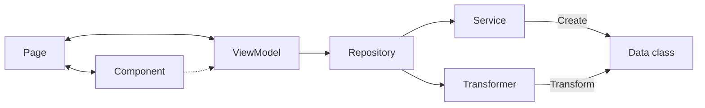

# android-mvvm

Rebased on [catalinghita8/android-compose-mvvm-foodies](https://github.com/catalinghita8/android-compose-mvvm-foodies) updated with latest tools, more code features, better structure and stability.

# Architecture

Based on previous Flutter I had worked on ([AlexisL61/FlutterTemplate](https://github.com/AlexisL61/FlutterTemplate#flutter_template)), I tried to implement that same following workflow.

# Features
- Splitting components into atomic-design modules for better reusability
- Better UI state management
- Better single responsibility principle implementation
- Repositories extracted from the Model folder since it's not the same use case
- Better stability with API

## TODO
- [ ] Need to implement Navigation 3 to be "near perfect", using these examples: [nav3-recipes](https://github.com/android/nav3-recipes)